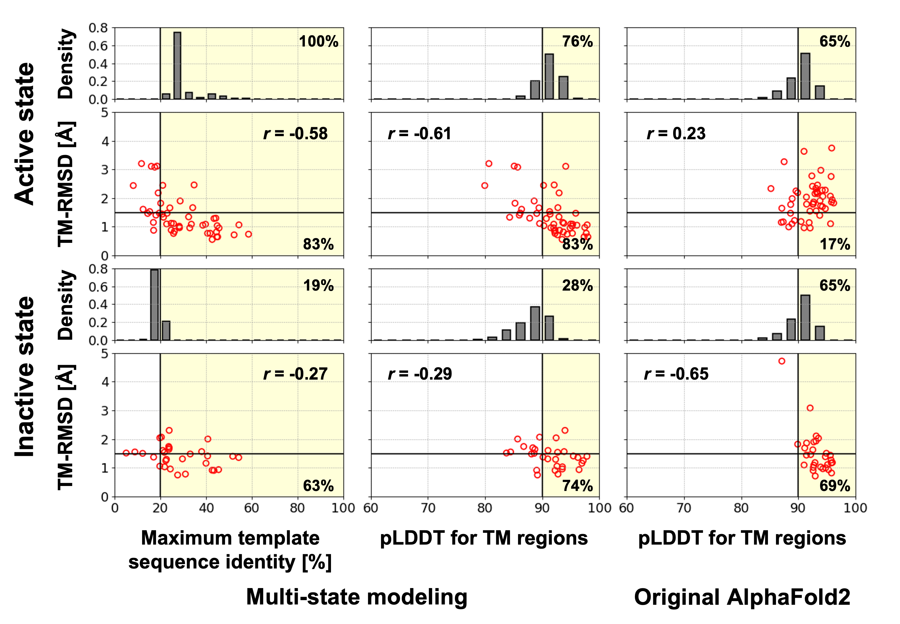

## Table of Contents
- [Description](#Description)
- [Download All Models](#Download-Models)
- [Models](#Models)
- [References](#References)

## Description

This database serves as a repository for human odorant receptor models in both active and inactive states. Our in-house multi-state modeling protocol [1] and the original AlphaFold2 [2] were employed to predict two models for each state of every human odorant receptor. Previously, we developed a modified AlphaFold2 modeling protocol capable of accurately predicting the active and inactive states of non-olfactory GPCR structures. The original AlphaFold2 algorithm exhibits a preference for the inactive state in most GPCR classes, except for class B GPCRs. To model both active and inactive states, we had to (1) utilize GPCR templates in the desired activation state and (2) modify the input MSA to enforce the use of the input templates. Our previous analysis on non-olfactory receptors revealed that our multi-state modeling protocol achieves more accurate predictions for the active state compared to the original AlphaFold2, while its performance for the inactive state structures remains comparable.

To estimate the prediction accuracy for each state, we relied on two metrics: maximum template sequence identity and pLDDT score. With the multi-state modeling protocol, which incorporated template-driven information and discarded most MSA-based features, we observed a strong correlation between prediction accuracy (measured in TM helix RMSD) and the maximum template sequence identity. Based on our analysis of non-olfactory receptors, predictions using templates with sequence identities above 20% yielded a high success rate: 83% for the active state and 63% for the inactive state. Moreover, utilizing the pLDDT score, we achieved success rates of 83% and 74% for the active and inactive states, respectively, when the pLDDT score exceeded 90. Conversely, the original AlphaFold2 protocol showed no dependence on template similarity, and its pLDDT score merely correlated with accuracy for the active state conformation, as it primarily favored predicting the inactive state. By leveraging these correlations, we can infer the modeling accuracy for each state and modeling protocol.

For the active state models of odorant receptors, all models were predicted using the first odorant receptor structure (PDB ID: 8f76) with a minimum sequence identity of 20%. A total of 76% of these models exhibited pLDDT scores higher than 90, indicating their expected high accuracy. Given that the original AlphaFold2 tends to predict GPCRs in the inactive state, we recommend employing the active state models predicted by our multi-state modeling protocol. On the other hand, for the inactive state models of odorant receptors, most models generated by the multi-state modeling protocol may be less accurate due to the absence of known odorant structures in the inactive state. As the original AlphaFold2 models are more likely to represent the inactive state, we suggest utilizing the inactive state models generated by the original AlphaFold2, unless their pLDDT scores are significantly lower than those of the inactive state models generated by the multi-state modeling protocol or they do not resemble the inactive state.

#### Figure 1. Odorant receptor structures in the active (left) and inactive (right) state.
All human odorant receptor structure models are superpose to the first OR structure (PDB ID: 8f76, shown in grey ribbon). Displayed active and inactive state models
are predicted by our multi-state modeling protocol and the original AlphaFold2, respectively. Models are colored by pLDDT score: red-to-blue for low-to-high pLDDT scores.

#### Figure 2. Estimation of modeling accuracy.
Red circles represent relationships between prediction accuracy measured in TM helix RMSD (TM-RMSD) and each metric for the benchmarked non-olfactory receptors. Pearson correlation coefficient for each relationship are denoted as "_r=_". A model that is predicted using a template with a sequence identity above 20% or has a pLDDT higher than 90 was likely to be accurate (TM-RMSD < 1.5 Å). These selection criteria are shown as yellow background color. The ratio of accurate models among the selected models are noted at lower right corner. For human odorant receptors, distributions of the maximum template sequence identity and the pLDDT score are shown as grey histograms. The percentage of that are likely to be accurate assessed by the selection criteria are noted at top right corner. 

## Download All Models
- [Odorant receptors](https://drive.google.com/file/d/1y3egK6A4kLNO9xSaRwAbsUsa97HayFSS/view?usp=share_link)
- [Trace amine-associated receptors](https://drive.google.com/file/d/1X9SDzZZYUi9jAFFw5Gru6Tug3QMyU-J3/view?usp=drive_link)

## Models
Use Ctrl-F (or Command-F on Mac OS) to search an odorant receptor on [this page](models.md).

## References
1. Heo, L. and Feig, M., Multi-State Modeling of G-protein Coupled Receptors at Experimental Accuracy, _Proteins_ (**2022**), 90(11), 1873–1885. [Link](https://onlinelibrary.wiley.com/doi/10.1002/prot.26382)  
2. Jumper, J. _et al._, Highly accurate protein structure prediction with AlphaFold, _Nature_ (**2021**), 596, 583-589. [Link](https://www.nature.com/articles/s41586-021-03819-2) 

## Updates
- June 08, 2023: Added Trace amine-associated receptors (TAAR) models.
- May 14, 2023: Initial release
